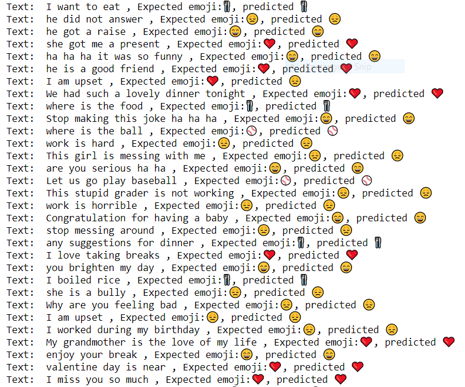

# Emojify-LSTM-model

## Overview
This project uses LSTM network & GloVe embeddings to develop a model which maps an emoji to a text based on the context.

## Dependencies - Python 3.6
1. Tensorflow
2. Keras
3. emoji
4. pandas

## Dataset
Labeled data of training and testing sets is provided in the repo. Download GloVe embeddings [here.](https://www.kaggle.com/watts2/glove6b50dtxt)

## Results

